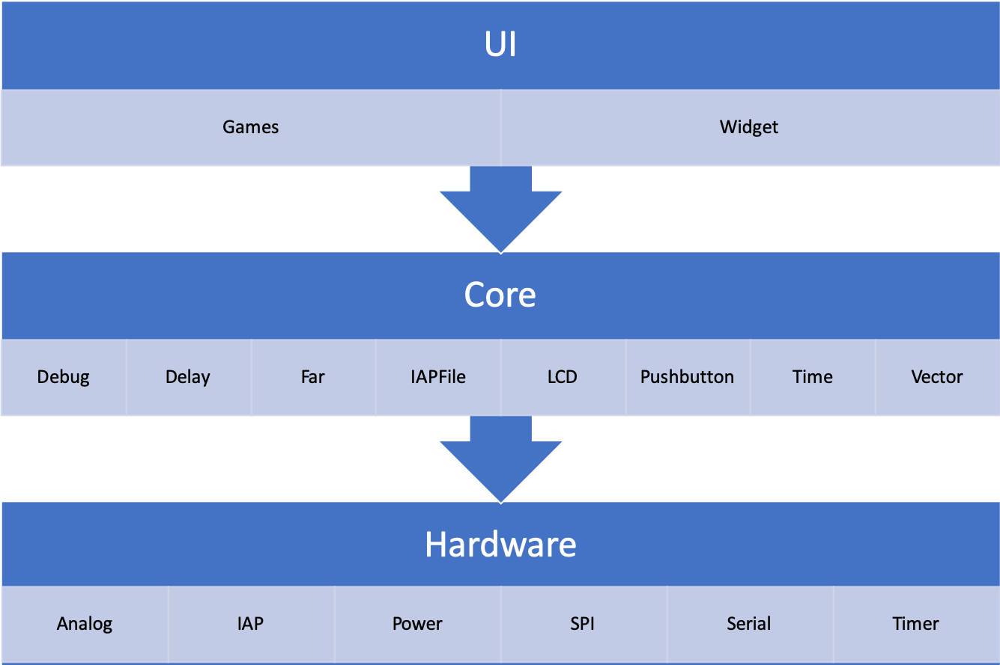
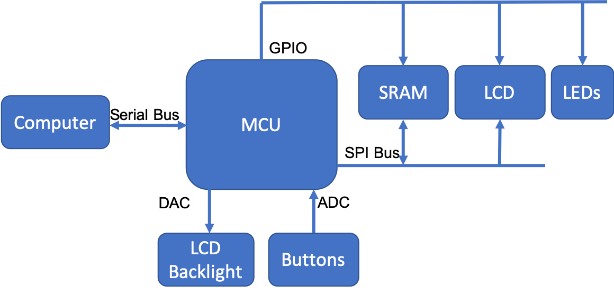
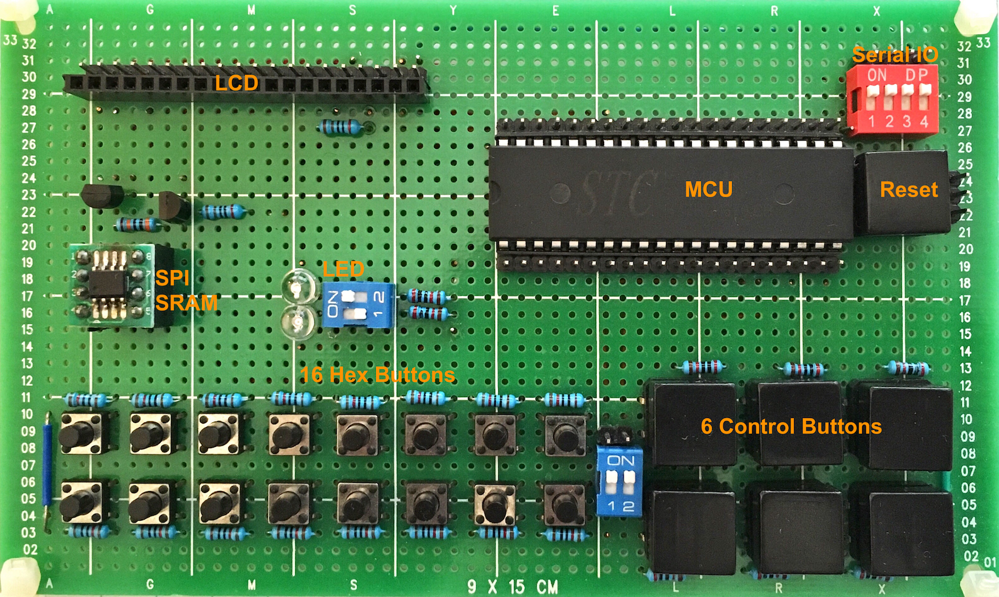

# 8051GameConsole
A game console based on 8051 (Intel MCS-51) microprocessor.

## Hardware Features
1. STC15W4K48S4 MCU clocked at 33.1776 MHz, 48 KB Flash Storage, 4 KB SRAM, and 10 KB EEPROM
1. 23LC512 with 64 KB SPI SRAM
1. 12864 black-and-white LCD with backlight adjustment
1. 16 + 6 push buttons
1. Serial IO

## Software Diagram


## Hardware Diagram


## Component


## Gameplay


## File Structure
```
.
├── Core                            System core functions
│   ├── Debug                       Debug output routines
│   ├── Delay                       Delay routines
│   ├── Far                         SPI SRAM driver & dynamic memory allocation routines
│   ├── IAPFile                     File system routines
│   ├── LCD                         LCD routines
│   ├── Pushbutton                  Push button routines
│   ├── Time                        System timer routines
│   └── Vector                      Variable length array
│       ├── Vector                  General purpose vector with pointers
│       └── VectorInt               Specific purpose vector with integets
├── Game                            Games
│   └── Snake                       Classic Snake game
├── Hardware                        MCU Hardware drivers
│   ├── Analog                      Analog IO driver
│   ├── IAP                         EEPROM driver
│   ├── Power                       power management driver
│   ├── SPI                         SPI interface driver
│   ├── Serial                      serial interface driver
│   └── Timer                       timer driver
├── Main                            Main function
├── Version                         Source code version info
└── Widget                          GUI widgets
    ├── InputDialog                 Box widget that receives a single input
    ├── ListWidget                  Full-screen widget that lists items to be selected
    └── ListWidgetItem              A Single item in ListWidget
```
